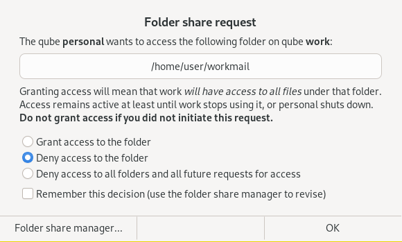
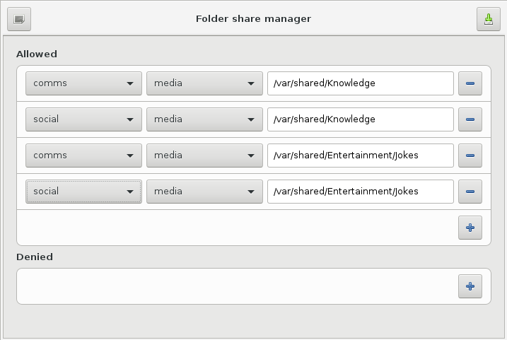

# Shared folders for Qubes OS

**Connect qube storage to another qube.**  Access and manage folders
saved in one qube (or a file server connected to it) from another
qube, transparently, as they were in the other qube.

We have some [to-do items](./TODO.md) which we'd love your help with!

## Principle

The programs in this project collaborate together to allow a qube
to *mount* a folder in another qube, using the Plan 9 file system
as a transport mechanism, with `diod` (a Plan 9 userspace server)
running on the server qube, and the `v9fs` kernel file system module
on the client qube.  These two components talk over the Qubes RPC
mechanism.

The client initiates a Qubes RPC connection to the server qube,
asking it to share a specific folder (which must exist).  If the RPC
mechanism authorizes it (by prompting you), then the server qube
starts a `diod` instance, and the client uses the established I/O
channel to mount the shared folder onto a folder of its file system
tree.

## Usage

The following instructions assume that the qube which contains the
files you want to share is named `server` and the qube where you
want to access the files is named `client`.  They also assume you
successfully finished the one-time installation instructions below.

### Connect to a folder in another qube

To mount `/home/user` from the `server` VM onto `/home/user/mnt`,
run the following on a terminal of `client`:

```
cd /home/user
mkdir mnt
qvm-mount-folder server /home/user mnt
```

At this point you will see an authorization message from dom0 asking
you if you really want to give `client` access to `server`'s files.



This access can be denied one-time or perpetually, and it can also
be granted one-time (for the duration of the mount) or permanently.
Note that the access granted is limited to the requested folder and
all subfolders (modulo file permissions on the shared folder) and,
once granted, access lasts until the `server` qube is shut off, or
the `client` qube unmounts the shared folder.

Authorize the access by confirming the name of the qube (`server` on
the dialog and continuing.

**Presto.**  You should be able to use a file manager, a terminal, or
any of your favorite applications to use files in `/home/user/mnt`
-- these files are all stored in `server` on folder `/home/user`.

### Disconnect from the folder

To finish using it, run `sudo umount /home/user/mnt`.

### In case of error

If your `server` qube shuts off before you unmount the mounted share,
you'll see `I/O error`s on the `client` qube whenever you attempt
to access the mounted share.  You can always unmount the errored
folder to resolve the issue.

### Manage file shares

Your dom0 has a settings tool called *Folder share manager*
(`qvm-folder-share-manager`) that allows you to define or revoke
*permanent* grants or denials on particular file shares:



Temporary one-time grants or denials are handled internally, not
persisted for long (they are ephemeral) and they cannot be modified
through this settings tool.

## Comparison with other solutions

* File copy/move between VMs: serves a different use case, although
  admittedly it is more secure than this solution given the smaller
  attack surface.
* `rsync` via qrexec / `qubes.ConnectTCP`: large codebase to trust,
  plus extremely inconvenient compared to a simple mounted file share,
  as the user has to (1) configure low-level settings (2) manage the
  synchronization manually (3) take care to remember to sync up.
* Syncthing: in principle, it can work to synchronize across qubes,
  as well as other equipment.  However, it requires networking,
  it's a large codebase, and it results in duplication of files
  across all synced qubes.
* NFS / SAMBA shared over `qubes.ConnectTCP`: this solution is much
  simpler, because it requires zero configuration.  This solution
  should also, by some metrics, be less risky than NFS and SAMBA,
  which are both much larger codebases with many more features that
  you are simply *not going to need* in the context of sharing files
  between qubes.
* NFS / SAMBA mounted from a NAS: this solution is much simpler than
  that, and — unlike mounting a NAS share on the target VM — it
  requires neither other equipment nor a LAN to work properly.
  Furthermore, since NAS solutions obligate you to setup and manage
  authentication and authorization for specific folders, this ends
  up discouraging you from adopting "one share + one mount per qube",
  which reduces your overall security.  Plus, if a qube with access
  to the share is compromised, then the whole NAS may be attacked
  from the compromised qube.

For comparison:

* `diod` raw C language line count: *40 thousand*
* `samba` raw C / C++ language line count: **over 2 million**
* NFS' and rsync's line counts are homework for the reader.

## Security considerations

* There is currently no way to control *which* folders of the server
  qube can be requested by client qubes.  In principle this should
  be doable because `diod` is able to export only a subtree of any
  file system hierarchy.
* A compromise of the client qube could be used to escalate into a
  compromise of the `diod` daemon running on the server qube -- in
  which case the server qube can be considered compromised.  The
  converse case is possible as well.
  In other words: the client qube trusts that `diod` (on the server)
  will not send malicious data back, and the server qube trusts that the
  `v9fs` kernel module on the client qube will not send malicious data.
  This is an inherent risk of running a client/server setup that uses
  a low-level binary protocol and two sides (a client and a server),
  whether it be Git, SSH, or any other protocol.

If these security considerations cannot be accommodated by your
security model, you are better off *not using this program*.

## Installation

*Note: the following instructions show how to build the packages from
scratch.  If you want to test using prebuilt packages (for Fedora
34 on the template, and Fedora 25 / 32 on dom0), they are available
[here](https://rudd-o.com/uploads/projects/files/qubes-shared-folders),
but note they will not be updated in the future, and I cannot guarantee
their integrity at this time.*

First, build a [`diod`](https://github.com/Rudd-O/diod) RPM package
(install the `munge-devel` and `ncurses-devel` packages first):

```
git clone https://github.com/Rudd-O/diod
cd diod
./autogen.sh && ./configure --prefix=/usr && make dist && rpmbuild -ts *tar.gz
```

Then, install this package on the template of the qube you plan to
*share your files from*.

Now build RPM packages for this software:

```
git clone https://github.com/Rudd-O/qubes-shared-folders
cd qubes-shared-folders
make rpm
```

Two RPMs will result:

1. `qubes-shared-folders-...noarch.rpm`
2. `qubes-shared-folders-dom0-...noarch.rpm`

Install the first one in the template of the qube you plan to
*share your files from*, as well as the template of the qube
you plan to *access your files in*.

Install the second one in dom0.  This package contains policy
(default `ask`) for the service.

Now shut down all involved qubes, to ensure the installation takes.
You don't need to shut down your computer or dom0.
